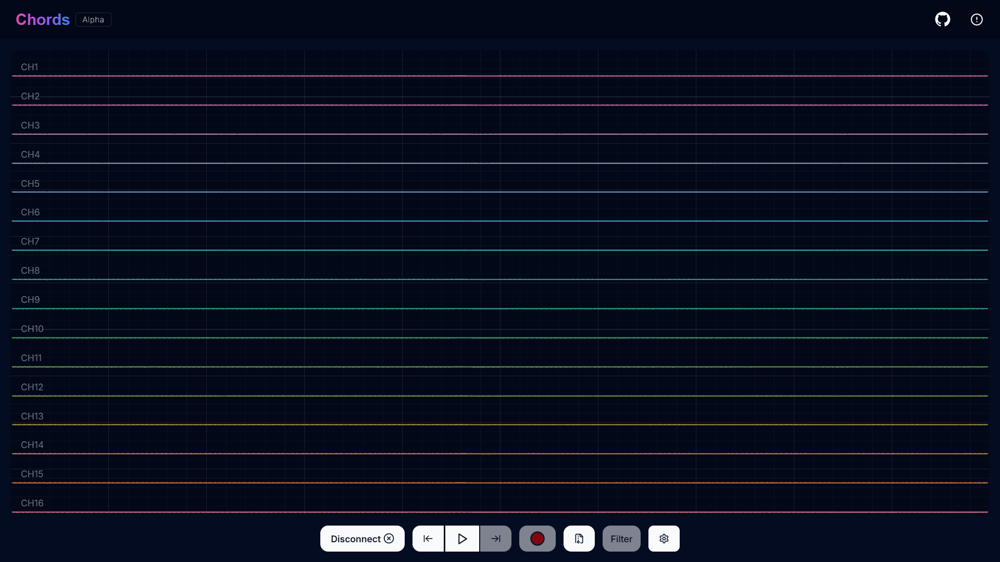

# NeuroSense AI 🧠✨

NeuroSense AI is an advanced, web-based platform for personalized EEG processing and wellness analytics. It allows users to connect their EEG headsets directly via the browser, visualize real-time brainwave activity, record sessions, and analyze cognitive trends over time.



## 🚀 Core Features

- **Seamless Bluetooth & Serial Connectivity:** Connect your NeuroSense EEG cap directly from the browser using the Web Serial API. Auto-board detection sets the ADC resolution based on the hardware vendor ID.
- **Real-time Multi-Channel Plotting:** High-performance, low-latency visualization of incoming EEG signals using WebGL Plot. Each channel is color-coded for easy identification.
- **FFT & Band Power Visualizer:** Monitor your brain states in real-time. The FFT visualizer dissects your brainwaves into standard frequency bands (Delta, Theta, Alpha, Beta, Gamma) and displays real-time relative power percentages in a beautiful bar chart.
- **Beta Candle (Focus Indicator):** A unique, immersive visual indicator where a brighter "candle" represents higher Beta wave activity, indicating focus or alertness.
- **Record & Local Storage:** Record EEG data and save it directly to your browser's IndexedDB. Download sessions as `.csv` files for further clinical or personal research.
- **NeuroTwin AI Drift Analysis:** The Analysis Dashboard provides AI-powered digital twin tracking. Compare baseline and post-session EEG recordings to monitor long-term cognitive drift and generate personal NeuroPrint radar charts.
- **Advanced Filtering:** Apply digital filters (Notch 50Hz/60Hz, Highpass, Lowpass) to remove artifacts and AC interference from the raw EEG signals on the fly.

## 🛠️ Technology Stack

This project is open-source, free to use, and powered by modern web technologies making it super fast, efficient, and reliable:

- **Frontend Framework:** [Next.js](https://nextjs.org/) (React 18)
- **Language:** [TypeScript](https://www.typescriptlang.org/)
- **Styling:** [Tailwind CSS](https://tailwindcss.com/) + Shadcn UI
- **Data Visualization:** [Recharts](https://recharts.org/) (for static analysis) & [WebGL Plot](https://webgl-plot.vercel.app/) (for real-time streaming)
- **Client Storage:** [IndexedDB API](https://developer.mozilla.org/en-US/docs/Web/API/IndexedDB_API) via web workers.
- **Hardware Integration:** [Web Serial API](https://developer.mozilla.org/en-US/docs/Web/API/Web_Serial_API)

## 💻 Getting Started

### 1. Prerequisites
- [Node.js](https://nodejs.org/en/) (v18 or higher)
- A chromium-based web browser (Chrome, Edge, Brave) for Web Serial API support.

### 2. Local Setup
Clone the repository and install dependencies:
```bash
git clone https://github.com/kunal-58625/NeuroSense-AI.git
cd NeuroSense-AI
npm install
```

### 3. Run Development Server
Start the Next.js development server:
```bash
npm run dev
```
Open [http://localhost:3000](http://localhost:3000) in your browser.

## 📖 How to Use

1. **Connect:** Click the **Visualize Now** or **Connect Bluetooth** button. Select your EEG device from the browser popup.
2. **Stream:** Once connected, the dashboard will immediately begin plotting the raw time-series data. 
3. **Analyze:** Toggle to the **Band Power** or **Beta Candle** views to see the real-time FFT breakdown.
4. **Record:** Click the red **Record** button at the bottom to start logging the data. Click again to stop.
5. **Review:** Click the **File Archive** icon to view your saved datasets. You can download the `.csv` or analyze it using the NeuroTwin Analysis page.
6. **Compare:** Go to the `/analysis` page to upload your baseline and post-session `.csv` files to see your cognitive drift and personalized insights.

## 🤝 Contributing

Contributions to improve data processing algorithms, UI enhancements, or adding support for new EEG boards are always welcome! Feel free to open an issue or submit a pull request.
